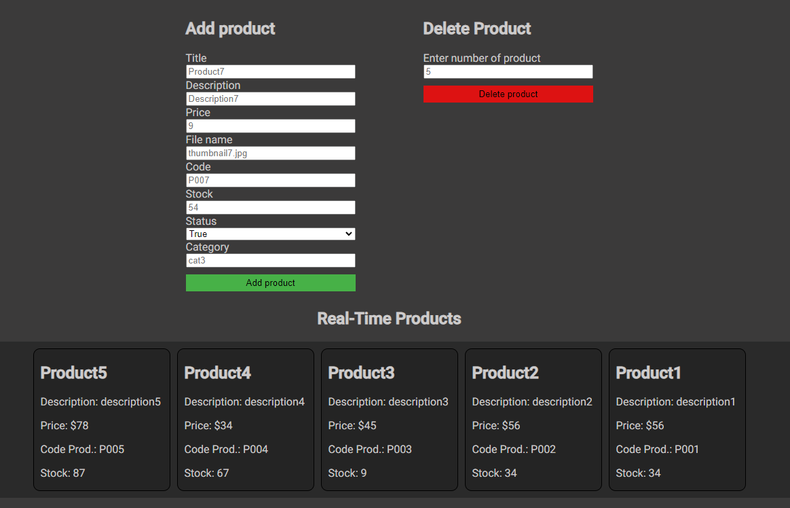

#Aspectos a incluir

1- Agregar el modelo de persistencia de Mongo y mongoose a tu proyecto.✅

2- Crear una base de datos llamada “ecommerce” dentro de tu Atlas, crear sus 
colecciones “carts”, “messages”, “products” y sus respectivos schemas.✅

3- Separar los Managers de fileSystem de los managers de MongoDb en una sola
carpeta “dao”. Dentro de dao, agregar también una carpeta “models” donde vivirán
los esquemas de MongoDB. La estructura deberá ser igual a la vista en esta clase. ✅

4- Contener todos los Managers (FileSystem y DB) en una carpeta llamada “Dao”. ✅

5- Reajustar los servicios con el fin de que puedan funcionar con Mongoose en
lugar de FileSystem. ✅

6-NO ELIMINAR FileSystem de tu proyecto.✅

7- Implementar una vista nueva en handlebars llamada chat.handlebars, la 
cual permita implementar un chat como el visto en clase. Los mensajes deberán
guardarse en una colección “messages” en mongo (no es necesario implementarlo
en FileSystem). El formato es: ✅

{user:correoDelUsuario, message: mensaje del usuario}✅

8- Corroborar la integridad del proyecto para que todo funcione como lo ha hecho hasta ahora.

#DEPENDENCIES
    - express "^4.18.2"
    - express-handlebars: ^7.1.2"
    - socket.io: ^4.7.4
    - mongoose: "^8.1.1"
  
*** GET ***  
~~~
http://localhost:8080/api/products/
~~~

